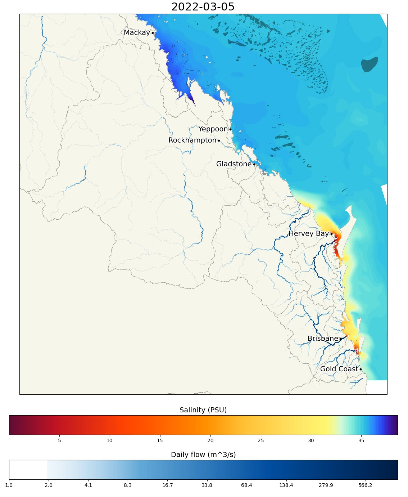

# eReefs Grid To Grid prototype visualisations (2023-09)
This repository contains the Python scripts for prototype visualisations of the Grid 2 Grid (G2G) land runoff modelling done by the Bureau of Meteorology (BOM) data, along with the eReefs Hydrodynamic model (CSIRO GBR1 Hydro v2.0). The purpose of this script is to prototype the visualisations of these two datasets prior to incorporating them into a production workflow. 

This script uses draft G2G model data that has a limited geographic scope. The G2G modelling was developed primarily to generate correct river flows along the boundary to the GBR, as a driving input to the eReefs Hydrodynamic model. It was not originally intended to accurately characterise the transient flows far up the catchments. That is the flows along the coastline are calibrated, but the flows far up the catchments are not. The flows across the landscape are driven by rain events but are also constrained by gauged flows in the rivers. This correction in the flows can occasionally be seen in the visualisations, where a part of the catchment shows a small flow that seems to stop and go nowhere. This is a result of the correction being applied from the gauged flow location. This is more obvious for low flow events, where the G2G slightly overestimates the overland flow in some sub-catchments. These get corrected down the catchment at the gauged stations.

It should also be noted that the G2G flows being visualised were not the matching river flows used in the GBR1 Hydro v2.0 modelling. The G2G river flows are still being integrated into a new version of the GBR1 Hydro modelling. The river flows in the Hydro v2.0 modelling are based on scaled (to compensate for the approximate proportion of the catchment that is not directly measured) gauge stations.

The videos generated by these scripts are available for [Preview and Download G2G - Salinity Videos](https://nextcloud.eatlas.org.au/apps/sharealias/a/ereefs-g2g-prototype-visualisations) folder.



# Source data
The basemap data used in these plots is available from [eReefs Basemap - GIS layers Reefs, Rivers, Cities, Basins, Countries (AIMS)](https://doi.org/10.26274/g6sn-s290).

The eReefs data used to generate these plots [AIMS THREDDS - Hydrodynamic model - 1km grid (gbr1_2.0) - daily model data](https://thredds.ereefs.aims.gov.au/thredds/catalog/ereefs/gbr1_2-0.html?dataset=gbr1_2.0-daily)

# License

This code is made available under an MIT license and the plots are make available under a Creative Commons Attribution 4.0 license, with attribution: Eric Lawrey, AIMS.

# Setting up the environment
The following are instructions for reproducing these plots.

Create a Python Virtual Environment. I would recommend using Anaconda on Windows.

Certainly! Here's a step-by-step guide to set up a virtual environment in Anaconda on Windows and install the specified libraries:

1. **Install Anaconda (If you haven't already)**:
   - Download the Anaconda installer for Windows from [here](https://www.anaconda.com/products/distribution#download-section).
   - Follow the on-screen prompts to install Anaconda.
   - After installation, ensure that the Anaconda binaries are in your system's PATH or use the Anaconda Prompt for all the commands below.

2. **Open Anaconda Prompt**:
   - Search for "Anaconda Prompt" in your Windows search bar and open it. This command prompt has all the necessary configurations set for Anaconda.

3. **Create a new virtual environment**:
   - Use the following command to create a new virtual environment. Here, I'll name it `ereefs_maps`, but you can give it any name you prefer.
     ```
     conda create --name ereefs_maps python=3.10
     ```
   - You can replace `3.10` with your preferred Python version, but make sure the libraries you want to install are compatible with that version.

4. **Activate the virtual environment**:
   - Once the environment is created, activate it using the following command:
     ```
     conda activate ereefs_maps
     ```

5. **Install Libraries from the `requirements.txt` File**:

   Navigate to the directory where your `requirements.txt` is located (using the `cd` command). Then, use the following command to install the packages:
   ```bash
   pip install -r requirements.txt
   ```

   This will install all the libraries specified in the `requirements.txt` file into your `ereefs_maps` environment.

6. **Verify the installations**:
   - You can check that the libraries have been installed correctly by activating the environment and then launching Python:
     ```bash
     python
     ```
   - And then, for each library in the requirements try and import them:
     ```python
     import xarray
     import geopandas
     import matplotlib
     import cartopy
     ...
     ```
   - If no errors pop up after these import statements, it means the libraries are correctly installed.

6. **Run the scripts 01-...05**:
   Run each of the scripts in turn.
   
7. **Deactivate the environment when done**:
   - When you're done working in the `ereefs_maps` environment, deactivate it with:
     ```bash
     conda deactivate
     ```

That's it! You now have a virtual environment set up in Anaconda on Windows.

# Overview of scripts
Prior to reproducing the plots you will need to obtain a copy of the draft G2G BOM dataset. This data is not yet public and so it is not scripted for automatic download. Once you have this dataset you will need to adjust the path to this data in `03-animate-G2G-and-salinity.py`. The base map data and the eReefs Hydro v2.0 data can be obtained by running the scripts `01-download-base-map-data.py` and `02-get-daily-ereefs-hydro-data.py`.

## 01-download-base-map-data.py
This script downloads the shapefiles needed to make the basemap in the plots. The data can be manually downloaded in a browser from: https://nextcloud.eatlas.org.au/s/RGwTFcLtmPApEcQ/download and extracted into `src-data/GBR_AIMS_eReefs-basemap`.

## 02-get-daily-ereefs-hydro-data.py
This script downloads the eReefs Hydro data from the AIMS THREDDS data service using OpenDAP. It downloads the surface (-2.35 m) Salinity (salt) from the GBR1 AIMS eReefs THREDDs OpenDAP data service. The data is cropped to a bounding box that aligns with the southern regional extent of the G2G model data. It saves the data as local NetCDF files for later processing. 

This script is designed to cope with cancellation and resumption. If the script is cancelled mid-way through processing, then restarted, any data file that has already been downloaded will be not be redownloaded, speeding up the resumption.  

This takes about 1-2 sec per day to download and 6.2 MB per day.

## 03-animate-G2G-and-salinity.py
This script combines the G2G data with the eReefs Hydro Salinity data into a single visualisation. Some of the base map elements are put on the map (reefs, basins, rivers, and cities). The colour styling of the salinity was taken from https://github.com/eatlas/GBR_AIMS_eReefs-basemap/blob/main/colour-ramps/styles/RedBlueRainbowSalt_24-36-PSU.pal.

This script is designed to generate an animation for each year of data, noting that the matching data needs to be downloaded using `02-get-daily-ereefs-hydro-data.py`. This script uses the test G2G model data from BOM. This data is not available publicly yet. It was downloaded from the eReefs area on NCI. 

# Script development notes and the use of assisted coding with GPT-4:
A some assistance for the creation of these scripts was provided by GPT-4 using the Code interpreter and the normal GPT-4 chat.

I have recorded a summary of the key prompts that summarize the information that was requested from GPT-4.

## Installation instruction prompt
I want to setup a virtual environment in anaconda on windows with the following libraries installed: xarray geopandas matplotlib cartopy netCDF4. Can you generate a set of instructions to do this. How would us do this with a requirements.txt document?

## 01-download-base-map-data.py prompt

I want a Python script that will download and unzip a file from a specified URL. Can this be done with no additional libraries, just the ones already in Python 3.10. Can it also provide some feedback during the download and specify a user agent in the request.

## 02-get-daily-ereefs-hydro-data.py 
I want to use OpenDAP to download a time series of a particular variable at a particular depth. The opendap service URL is https://thredds.ereefs.aims.gov.au/thredds/dodsC/gbr1_2.0/daily.nc.html. This service contains many variables, but I only want to download the Salinity variable 'salt' : Array of 32 bit Reals [time = 0..3181][k = 0..15][latitude = 0..4236][longitude = 0..2670]). I want to download and save the salt variable for a specific depth (k=14) as a single NetCDF file locally. I want it to provide some feedback during the downloading, by downloading one month at a time and saving to NetCDF, printing an update. I want to be able to specify the start and end date to be downloaded. Can you use xarray.

**Follow up:**
I want to limit the spatial extend of the data to download to a bounding box (North:-20.75, South:-28.3, West:148.8, East:154)

**Changes:**
I added code for selecting the depth index based on depth value. Added folder path for data in src-data. There was a lot of debugging caused by the selection of the dates. The fix seemed to be to add +14hours to align with the dates in the file. The other problem was the bounding box selection. GPT4 generated code with north and south swapped, causing empty files. I added code to allow better restarting of the download, by first downloading to a temporary file, then moving as a last step. It also skips files that are already downloaded.

## 03-animate-G2G-and-salinity.py
This script was mainly based on an extension of a originally script developed by Ben Farmer. Various adjustments were made with the help of GPT-4, however this code was a bit big for it to handle. 
