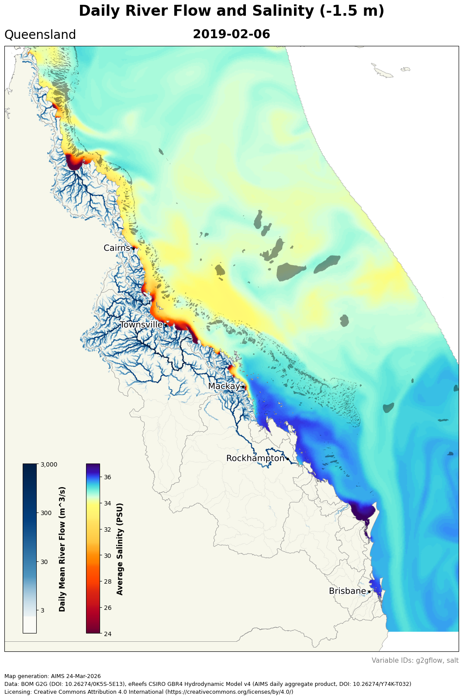

# eReefs Grid To Grid visualisation workflow (repository name retained from prototype phase)

This repository began as prototype code for visualising Bureau of Meteorology (BOM) Grid 2 Grid (G2G) land runoff
modelling data alongside the eReefs Hydrodynamic model (CSIRO GBR4 Hydro v4).

The same codebase was then refined and used to generate the final published data and visualisation products.
The repository name, `ereefs-g2g-prototype-visualisation`, has been retained for continuity with earlier development
and internal references.

For the published dataset record and citation details, refer to:
https://doi.org/10.26274/0K5S-5E13

This script uses draft G2G model data that has a limited geographic scope. The G2G modelling was developed primarily to
generate correct river flows along the boundary to the GBR, as a driving input to the eReefs Hydrodynamic model. It was
not originally intended to accurately characterise the transient flows far up the catchments. That is the flows along
the coastline are calibrated, but the flows far up the catchments are not. The flows across the landscape are driven by
rain events but are also constrained by gauged flows in the rivers. This correction in the flows can occasionally be
seen in the visualisations, where a part of the catchment shows a small flow that seems to stop and go nowhere. This is
a result of the correction being applied from the gauged flow location. This is more obvious for low flow events, where
the G2G slightly overestimates the overland flow in some sub-catchments. These get corrected down the catchment at the
gauged stations.

It should also be noted that the G2G flows being visualised were not the matching river flows used in the GBR4 Hydro
v4 modelling. The G2G river flows are still being integrated into a new version of the GBR Hydro modelling. The river
flows in the Hydro modelling are based on scaled (to compensate for the approximate proportion of the catchment
that is not directly measured) gauge stations.

The final published products generated by these scripts are available at:
[QLD_BOM_eReefs-g2gflow_2011-2023](https://nextcloud.eatlas.org.au/apps/sharealias/a/QLD_BOM_eReefs-g2gflow_2011-2023)

This web storage location includes both the visualisation products and the daily G2G data files.



## Quick note: Batch bash scripts

If you want end-to-end automation, use the batch scripts:

- `generate-and-publish-daily-g2g.sh` for daily G2G generation + S3 publishing
- `generate-all-videos.sh` for annual video generation

For required environment variables and `.env` setup, jump to **Batch helper scripts** below.

## Source data

The basemap data used in these plots is available
from [eReefs Basemap - GIS layers Reefs, Rivers, Cities, Basins, Countries (AIMS)](https://doi.org/10.26274/g6sn-s290).

The eReefs data used to generate these plots comes from the GBR4 v4 daily OpenDAP endpoint:
https://thredds.ereefs.aims.gov.au/thredds/dodsC/gbr4_v4/daily.nc

## Known G2G data quality exclusions

Some of the modelled years are excluded from this publication due to a known
issue in the exported G2G data:

- `2012`, `2014`, `2016`, `2020`, `2022`, `2023`

Issue summary:

- Flow areas with greater than `10` cumecs were set to null values during
  export.
- This makes these data files unsuitable for reuse.

To avoid producing misleading outputs, the scripts now skip these years by
default or return early when requested explicitly.

## License

This code is made available under an MIT license and the plots are make available under a Creative Commons Attribution
4.0 license, with attribution: Eric Lawrey, AIMS.

## Setting up the environment

The following are instructions for reproducing these plots.

Create a Python Virtual Environment. I would recommend using Anaconda on Windows.

Certainly! Here's a step-by-step guide to set up a virtual environment in Anaconda on Windows and install the specified
libraries:

1. **Install Anaconda (If you haven't already)**:
    - Download the Anaconda installer for Windows
      from [here](https://www.anaconda.com/products/distribution#download-section).
    - Follow the on-screen prompts to install Anaconda.
    - After installation, ensure that the Anaconda binaries are in your system's PATH or use the Anaconda Prompt for all
      the commands below.

2. **Open Anaconda Prompt**:
    - Search for "Anaconda Prompt" in your Windows search bar and open it. This command prompt has all the necessary
      configurations set for Anaconda.

3. **Create a new virtual environment**:
    - Use the following command to create a new virtual environment. Here, I'll name it `ereefs_maps`, but you can give
      it any name you prefer.

      ```bash
      conda create --name ereefs_maps python=3.10
      ```

    - You can replace `3.10` with your preferred Python version, but make sure the libraries you want to install are
      compatible with that version.

4. **Activate the virtual environment**:
    - Once the environment is created, activate it using the following command:

      ```bash
      conda activate ereefs_maps
      ```

5. **Install Libraries from the `requirements.txt` File**:

   Navigate to the directory where your `requirements.txt` is located (using the `cd` command). Then, use the following
   command to install the packages:
  
   ```bash
   pip install -r requirements.txt
   ```

   This will install all the libraries specified in the `requirements.txt` file into your `ereefs_maps` environment.

6. **Verify the installations**:
    - You can check that the libraries have been installed correctly by activating the environment and then launching
      Python:

      ```bash
      python
      ```

    - And then, for each library in the requirements try and import them:

      ```python
      import xarray
      import geopandas
      import matplotlib
      import cartopy
      ...
      ```

    - If no errors pop up after these import statements, it means the libraries are correctly installed.

7. **Run the scripts in order**:
  First run the one-time preprocessing script `00-generate-daily-g2g-aggregates.py` to generate
  daily aggregate G2G files for public hosting. Then run `01-download-base-map-data.py`,
  `02-get-daily-ereefs-hydro-data.py`, `03-download-daily-g2g-data.py`, and
  `04-animate-G2G-and-salinity.py`.

8. **Deactivate the environment when done**:
    - When you're done working in the `ereefs_maps` environment, deactivate it with:

      ```bash
      conda deactivate
      ```

That's it! You now have a virtual environment set up in Anaconda on Windows.

## Overview of scripts

Prior to reproducing the plots you will need access to daily aggregated G2G NetCDF files. This repository now includes
an automated download step for those files using `03-download-daily-g2g-data.py`. The base map data and the eReefs
Hydro v4 data can be obtained by running
the scripts `01-download-base-map-data.py` and `02-get-daily-ereefs-hydro-data.py`.

### 00-generate-daily-g2g-aggregates.py

This script is a one-time preprocessing step that converts the source hourly G2G files
(`src-data/g2g-data/extracted_files/<year>/sidb2netcdf_g2gflow_YYYY-MM-DD.nc`) into
daily mean NetCDF files. It writes one output file per day to:

- `src-data/g2g-data/daily-aggregated/<year>/BOM_eReefs-g2gflow_daily_YYYY-MM-DD.nc`

Features:

- processes all available years by default (or selected years)
- supports `--start-date` and `--end-date` filters
- skips files that already exist (safe restart behaviour)
- uses temporary output files (`.tmp.nc`) and atomic rename for robustness

Example usage:

```bash
# Process all years found in src-data/g2g-data/extracted_files
python 00-generate-daily-g2g-aggregates.py

# Process selected years only
python 00-generate-daily-g2g-aggregates.py 2019 2020

# Process a date range
python 00-generate-daily-g2g-aggregates.py --start-date 2019-01-01 --end-date 2019-12-31
```

### 01-download-base-map-data.py

This script downloads the shapefiles needed to make the basemap in the plots. The data can be manually downloaded in a
browser from: https://nextcloud.eatlas.org.au/s/RGwTFcLtmPApEcQ/download and extracted into
`src-data/GBR_AIMS_eReefs-basemap`.

### 02-get-daily-ereefs-hydro-data.py

This script downloads the eReefs Hydro data from the AIMS THREDDS data service using OpenDAP. It currently downloads
salinity (`salt`) from the GBR4 v4 endpoint at depth `-1.5 m` (mapped to the model `k` index through an internal lookup
table verified against the remote `zc` depth coordinate).

It supports:

- `year` positional argument
- `--start-date` and `--end-date` (YYYY-MM-DD) for partial-year downloads
- automatic restart support via temporary files (`.tmp`) and skip-if-exists logic

The download is cropped to a fixed bounding box aligned with the current G2G test extent:

- North: `-10.65`
- South: `-29.30`
- West: `141.8`
- East: `155.8`

This script is designed to cope with cancellation and resumption. If the script is cancelled mid-way through processing,
then restarted, any data file that has already been downloaded will be not be redownloaded, speeding up the resumption.

This takes about 1-2 sec per day to download and 6.2 MB per day.

### 03-download-daily-g2g-data.py

This script downloads daily aggregated G2G NetCDF files for a selected year from:

- `https://nextcloud.eatlas.org.au/s/LiRXpzLFBCWPf4f/download?path=%2Fdaily%2Fg2gflow-data%2F{year}`

It extracts only files matching:

- `BOM_eReefs-g2gflow_daily_*.nc`

to:

- `src-data/g2g-data/daily-aggregated/<year>/`

Example usage:

```bash
python 03-download-daily-g2g-data.py 2019
```

### 04-animate-G2G-and-salinity.py

This script combines the G2G data with eReefs Hydro salinity into a single visualisation. It now supports multiple
regions from one entry point using:

- `--regions queensland,north,central,south`
- `--preview-image` to export a PNG preview instead of an MP4

Additional behaviour now implemented in the script:

- data axes are normalized (sorted) before plotting to avoid raster orientation issues
- each raster layer uses its own geospatial extent, fixing cross-layer stretching/misalignment
- map extent can exceed data extent while data slicing remains clamped to available downloaded bounds
- salt layer is rendered underneath river flow
- salinity display range is fixed to `24` to `37` PSU with even-number ticks (`24, 26, ..., 36`)
- optional river-flow line thickening is applied at render time using a local max filter and supports fractional
  thickness values (for example `0.5`)

This script is designed to generate animations for a selected year, noting that matching salinity data must first be
downloaded using `02-get-daily-ereefs-hydro-data.py` and daily G2G NetCDF files must be downloaded using
`03-download-daily-g2g-data.py`.

## Batch helper scripts

The repository also includes two shell scripts for end-to-end batch processing.

### Environment configuration (.env)

An example environment file is provided as `.env.example`.

Recommended setup:

```bash
cp .env.example .env
# Edit .env with your local/project values
```

Before running either helper script, load variables from `.env` into your shell:

```bash
set -a
source .env
set +a
```

### generate-and-publish-daily-g2g.sh

Builds daily G2G NetCDF aggregates from source tar archives in S3 and uploads the generated daily files to a public S3
prefix.

Defaults:

- processes all years from `2011` to `2023` when no year arguments are provided
- removes temporary/downloaded local files after each year (`KEEP_LOCAL=false` by default)

Prerequisites:

- AWS CLI installed and authenticated
- permission to read source bucket and write destination prefix
- required environment variables:
  - `SOURCE_S3_PREFIX`
  - `DEST_S3_PREFIX`
  - `SOURCE_AWS_PROFILE`
  - `DEST_AWS_PROFILE`

Usage examples:

```bash
# Process all years (2011-2023)
bash generate-and-publish-daily-g2g.sh

# Process selected years only
bash generate-and-publish-daily-g2g.sh 2019 2021

# Keep local extracted and generated files after upload
KEEP_LOCAL=true bash generate-and-publish-daily-g2g.sh 2019
```

### generate-all-videos.sh

Runs the full video-generation workflow for a configured year range.

For each included year it:

- downloads eReefs Hydro salinity
- downloads daily G2G data
- renders animations
- deletes downloaded per-year data afterward to save disk space

Usage:

```bash
# Requires YEAR_START and YEAR_END in environment
bash generate-all-videos.sh
```

The final videos can be found in the `./export` folder.

## Initial script development notes and the use of assisted coding with GPT-4

Some assistance for the creation of these scripts was provided by GPT-4 using the Code interpreter and the normal
GPT-4 chat.

I have recorded a summary of the key prompts that summarize the information that was requested from GPT-4.

### Installation instruction prompt

I want to setup a virtual environment in anaconda on windows with the following libraries installed: xarray geopandas
matplotlib cartopy netCDF4. Can you generate a set of instructions to do this. How would us do this with a
requirements.txt document?

### 01-download-base-map-data.py prompt

I want a Python script that will download and unzip a file from a specified URL. Can this be done with no additional
libraries, just the ones already in Python 3.10. Can it also provide some feedback during the download and specify a
user agent in the request.

### 02-get-daily-ereefs-hydro-data.py prompt

I want to use OpenDAP to download a time series of a particular variable at a particular depth. The opendap service URL
is https://thredds.ereefs.aims.gov.au/thredds/dodsC/gbr1_2.0/daily.nc.html. This service contains many variables, but I
only want to download the Salinity variable 'salt' : Array of 32 bit
Reals [time = 0..3181][k = 0..15][latitude = 0..4236][longitude = 0..2670]). I want to download and save the salt
variable for a specific depth (k=14) as a single NetCDF file locally. I want it to provide some feedback during the
downloading, by downloading one month at a time and saving to NetCDF, printing an update. I want to be able to specify
the start and end date to be downloaded. Can you use xarray.

**Follow up:**
I want to limit the spatial extend of the data to download to a bounding box (North:-20.75, South:-28.3, West:148.8,
East:154)

**Changes:**
I added code for selecting the depth index based on depth value. Added folder path for data in src-data. There was a lot
of debugging caused by the selection of the dates. The fix seemed to be to add +14hours to align with the dates in the
file. The other problem was the bounding box selection. GPT4 generated code with north and south swapped, causing empty
files. I added code to allow better restarting of the download, by first downloading to a temporary file, then moving as
a last step. It also skips files that are already downloaded.

### 04-animate-G2G-and-salinity.py prompt

This script was mainly based on an extension of a originally script developed by Ben Farmer. Various adjustments were
made with the help of GPT-4, however this code was a bit big for it to handle.
